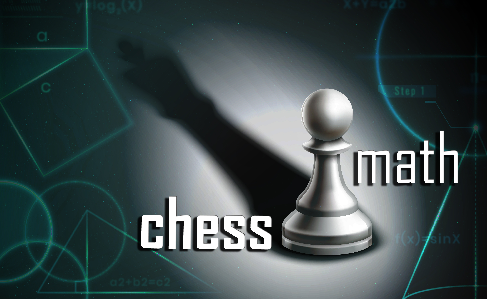

# ChessMath

## Duelli, enigmi e cerchi quadrati in 64 caselle

Benvenuti a **ChessMath**!

**ChessMath** è un laboratorio interattivo che trasforma la scacchiera in un dinamico laboratorio di logica e geometria, nato in occasione del _Festival della Scienza_ nel 2021, a Genova. Attraverso il gioco degli scacchi, i partecipanti esplorano concetti matematici complessi in modo intuitivo: dalle mosse delle pedine alle metriche non euclidee. Non si tratta solo di imparare a muovere i pezzi, ma di scoprire le leggi invisibili che governano lo spazio e il mondo in cui viviamo. Un’esperienza dove la matematica diventa divertimento e la logica si fa spettacolo.

### Collaborazioni

Questo progetto è testato con BrowserStack

### English
## Duels, puzzles and square circles in 64 squares
Welcome to **ChessMath**!

This project was born for [Festival Della Scienza of 2021](https://festival2021.festivalscienza.it/site/home/programma-scuole/chessmath.html), held in Genoa (Liguria) for Schools laboratories.

**ChessMath** is an interactive laboratory that transforms the chessboard into a dynamic laboratory of logic and geometry, born on the occasion of _Festival della Scienza_ in 2021, in Genoa. Through the game of chess, participants explore complex mathematical concepts in an intuitive way: from chess moves to non-Euclidean metrics. It's not just about learning to move the pieces, but about discovering the invisible laws that govern space and the world we live in. An experience where mathematics becomes fun and logic becomes entertainment.

#### Collaboration

This project is tested with BrowserStack